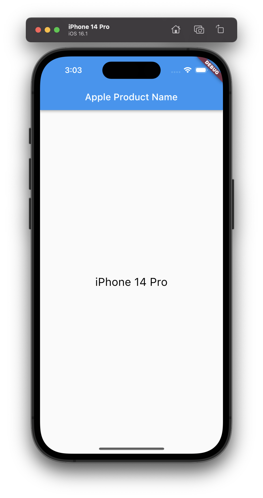

# apple_product_name

Library for translation apple device identifier to product name (e.g. 'iPhone13,2' to 'iPhone 12')

| iOS                    | macOS                      |
| ---------------------- | -------------------------- |
|  |  |
